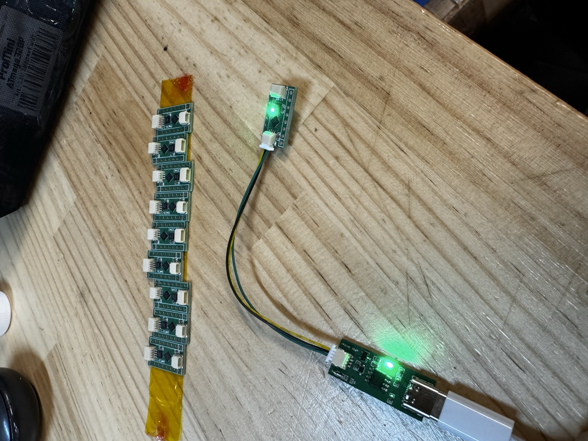

# ATtiny1616_RS485_Module

ATtiny1616マイコンとRS485トランシーバを搭載した小型の基板モジュールです。

## 概要

ATtiny1616とRS485トランシーバ（H485EIDQ）を13×22mmの基板に載せたモジュールです。
4ピンのJST SHコネクタで、複数台をRS485バスに数珠つなぎにできます。
空いているGPIOはすべて2.54mmピッチのピンヘッダに出してあります。

- **MCU**: ATtiny1616-MNR（QFN-20、tinyAVR 1-series）
- **通信**: RS485（半二重）
- **設計ツール**: EasyEDA Pro



*左：組み立て済みの基板。右：UPDIライタにつないで書き込んでいるところ*

## ハードウェア仕様

| 項目 | 内容 |
|---|---|
| MCU | ATtiny1616-MNR |
| RS485トランシーバ | H485EIDQ/TR（DFN-8） |
| 電源電圧 | 5V |
| 終端抵抗 | 120Ω（R6、裏面。標準では未実装） |
| 基板サイズ | 約13.2×21.8mm |
| RS485コネクタ | JST SM04B-SRSS-TB（SH 1.0mm 4ピン）。表面のU6と、裏面のU11（標準では未実装） |
| 書込みコネクタ | JST SM03B-SRSS-TB（SH 1.0mm 3ピン、UPDI）（U9） |
| GPIO | 2.54mmピッチ 8ピンヘッダ×2（H1・H2） |
| 状態LED | PB0（1kΩ経由、Highで点灯） |

### 裏面部品の実装（R6・U11）

裏面のR6（120Ω終端抵抗）とU11（2つ目のRS485コネクタ）は標準では未実装です。バス上のどこに置くかで、どちらか一方を実装します。

| 位置 | 実装する部品 |
|---|---|
| バスの末端 | R6（120Ω終端抵抗） |
| バスの途中（次のデバイスへつなぐ） | U11（コネクタ） |

```
[マスター]──U6[モジュール]U11──U6[モジュール]U11──U6[モジュール]R6
              （途中）              （途中）              （末端）
```

### MCUのピン割り当て

| ATtiny1616 | 機能 |
|---|---|
| PB2（TXD） | RS485 DI（送信） |
| PB3（RXD） | RS485 RO（受信） |
| PB4 | RS485 DE / RE#（送信イネーブル。Highで送信） |
| PB0 | LED（Highで点灯） |
| PA0 | UPDI |

RS485にはUSART0のデフォルトピン（PB2/PB3）を使っています。

### ピン一覧（Arduinoピン番号と周辺機能）

Arduinoピン番号はmegaTinyCoreの番号です。コードでは `PIN_PB0` のようにポート名で書くと、番号の取り違えを防げます。

| ピン | Arduino番号 | 基板での用途 | 主な周辺機能 |
|---|---|---|---|
| PA4 | 0 | H1-3 | ADC0 AIN4、SPI SS、PWM |
| PA5 | 1 | H1-4 | ADC0 AIN5、PWM |
| PA6 | 2 | H1-5 | ADC0 AIN6 |
| PA7 | 3 | H1-6 | ADC0 AIN7 |
| PB5 | 4 | H1-7 | ADC0 AIN8 |
| PB4 | 5 | RS485 DE / RE# | （使用中） |
| PB3 | 6 | RS485 RO | USART0 RX（使用中） |
| PB2 | 7 | RS485 DI | USART0 TX（使用中） |
| PB1 | 8 | H1-8 | ADC0 AIN10、I2C SDA（標準）、PWM |
| PB0 | 9 | LED | I2C SCL（標準）（LEDで使用中） |
| PC0 | 10 | H2-8 | SPI SCK（代替）、PWM |
| PC1 | 11 | H2-7 | SPI MISO（代替）、PWM |
| PC2 | 12 | H2-6 | SPI MOSI（代替） |
| PC3 | 13 | H2-5 | SPI SS（代替） |
| PA1 | 14 | H2-3 | ADC0 AIN1、SPI MOSI（標準）、I2C SDA（代替） |
| PA2 | 15 | H2-2 | ADC0 AIN2、SPI MISO（標準）、I2C SCL（代替） |
| PA3 | 16 | H2-1 | ADC0 AIN3、SPI SCK（標準）、PWM |
| PA0 | 17 | UPDI | （書き込み専用） |

PWMはmegaTinyCoreの標準設定で `analogWrite()` が使えるピンです。詳細はATtiny1616のデータシートで確認してください。

> **I2Cを使うときの注意**：I2C（TWI0）の標準ピンはSCL=PB0、SDA=PB1ですが、PB0はLEDにつながっています。I2Cは代替ピン（SCL=PA2、SDA=PA1）に切り替えて使ってください。megaTinyCoreでは `Wire.swap(1);` を `Wire.begin()` の前に呼びます。

### コネクタ

**RS485（U6・U11、2つとも同じピン配置）**

| ピン | 信号 |
|---|---|
| 1 | VCC |
| 2 | A |
| 3 | B |
| 4 | GND |

**UPDI（U9）**

| ピン | 信号 |
|---|---|
| 1 | UPDI |
| 2 | GND |
| 3 | VCC |

**H1**

| ピン | 1 | 2 | 3 | 4 | 5 | 6 | 7 | 8 |
|---|---|---|---|---|---|---|---|---|
| 信号 | GND | VCC | PA4 | PA5 | PA6 | PA7 | PB5 | PB1 |

**H2**

| ピン | 1 | 2 | 3 | 4 | 5 | 6 | 7 | 8 |
|---|---|---|---|---|---|---|---|---|
| 信号 | PA3 | PA2 | PA1 | UPDI | PC3 | PC2 | PC1 | PC0 |

## ファームウェア開発

| 項目 | 内容 |
|---|---|
| 開発環境 | PlatformIO（platform: `atmelmegaavr`、framework: `arduino`。コアはmegaTinyCore） |
| クロック | 20MHz（内部オシレータ。ヒューズOSCCFG=0x02） |
| 書き込み | SerialUPDI（U9コネクタ、57600bps） |

サンプル：

- [firmware/Blink_led](firmware/Blink_led)：状態LEDの点滅。新しいプロジェクトの雛形としても使えます

```bash
cd firmware/Blink_led
pio run                                                  # ビルド
pio run -t fuses  --upload-port /dev/cu.usbserial-XXXX   # ヒューズ書き込み（初回のみ）
pio run -t upload --upload-port /dev/cu.usbserial-XXXX   # 書き込み
```

ポート名は `pio device list` で確認できます。ヒューズを書き込まないと出荷時設定（16MHz）のまま動き、時間がずれます。

### ヒューズ設定

| ヒューズ | 値 | 内容 |
|---|---|---|
| WDTCFG（FUSE0） | 0x00 | ウォッチドッグ無効 |
| BODCFG（FUSE1） | 0x00 | BOD無効 |
| OSCCFG（FUSE2） | 0x02 | 20MHz |
| SYSCFG0（FUSE5） | 0xC4 | CRC無効、PA0=UPDI、チップ消去でEEPROMも消去 |
| SYSCFG1（FUSE6） | 0x06 | 起動待機時間 8ms |
| APPEND（FUSE7） | 0x00 | アプリ領域制限なし |
| BOOTEND（FUSE8） | 0x00 | ブートセクションなし |

> **警告**：SYSCFG0のRSTPINCFGを変更しないでください（例：`0xC8`）。PA0がUPDIからRESETや GPIOに切り替わり、通常のUPDIライタでは二度と書き込めなくなります。復旧には12V対応の高電圧UPDIライタが必要です。

## リポジトリ構成

```
hardware/
  schematic/   回路図（PDF）
  pcb/         EasyEDA Proプロジェクト（.epro2）、PCB図面
  gerber/      製造用Gerberファイル
  bom/         部品表（BOM）、部品配置（CPL）
  3d/          3Dモデル（STEP）
firmware/      サンプルファームウェア
docs/          ドキュメント、写真
```

## 基板データ

| ファイル | 置き場所 |
|---|---|
| 回路図PDF | `hardware/schematic/` |
| PCB図面PDF | `hardware/pcb/` |
| EasyEDA Proプロジェクト（.epro2） | `hardware/pcb/` |
| Gerber（zip） | `hardware/gerber/` |
| BOM（xlsx・csv） | `hardware/bom/` |
| 3Dモデル（STEP） | `hardware/3d/` |

.epro2は、EasyEDA Proの「ファイル → インポート」で開けます。

## 使用例

このモジュールは以下のプロジェクトで使っています。

- [KER_TLE_V3_Module](https://github.com/NaohiroIIDA/KER_TLE_V3_Module)：TLE5012B磁気角度センサーモジュール

## ライセンス

[MIT License](LICENSE)

回路図・基板データ・ファームウェアを含め、このリポジトリのすべてのファイルが対象です。著作権表示を残せば、商用・非商用を問わず自由に使用・改変・再配布できます。

## 作者

Naohiro IIDA
